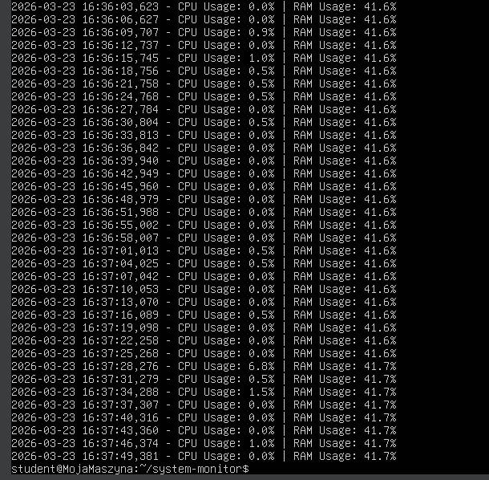

# Monitor wydajności systemu 

Profesjonalne narzędzie do monitorowania zasobów serwera (CPU, RAM) działające jako usługa systemowa (daemon) w systemie Linux. Projekt stworzony z myślą o architekturze serwerowej i niezawodności.

## 🚀 Główne cechy
- **Monitoring w czasie rzeczywistym**: Śledzenie zużycia procesora i pamięci operacyjnej.
- **Systemd Integration**: Działa jako usługa systemowa, co zapewnia automatyczny start przy bootowaniu i restart po błędach.
- **Logowanie zdarzeń**: Wszystkie dane są zapisywane w pliku `.log` z precyzyjnym znacznikiem czasu.
- **Konfigurowalność**: Możliwość dostosowania progów alarmowych i interwałów w pliku `.ini`.

## 🛠️ Technologie
- **Python 3.13
- **Biblioteka psutil** (interfejs do statystyk systemowych)
- **Linux (Ubuntu)**
- **Systemd** (zarządzanie usługami)

## 📋 Struktura projektu
- `monitor.py`: Główny skrypt monitorujący.
- `monitor.service`: Plik konfiguracyjny usługi dla systemd.
- `config.ini`: Plik z ustawieniami monitoringu.
- `monitor.log`: Plik z zapisanymi logami (generowany automatycznie).

## Podgląd działania:
Zrzut ekranu pokazujący przykładowe logi: 

